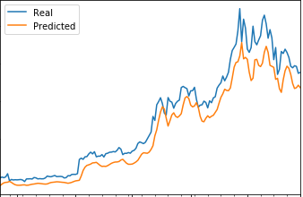

# Deep Learning model to predict Bitcoin price

In this project, two methods are used to predict the price of bitcoin.

1. To predict future prices using historical price movements with a 10 day window period.

2. Predictong the future prices using the Fear and Greed values.

LSTM model with 3 layers of neural networks has been used for both the methods.
LSTM model has one of the important parameters - batch size. It is the number of values that will be predicted at a time.
The model has been experimented with batch sizes of 1 and 2. The results are as follows:

Graphical representation of stock predictions:

